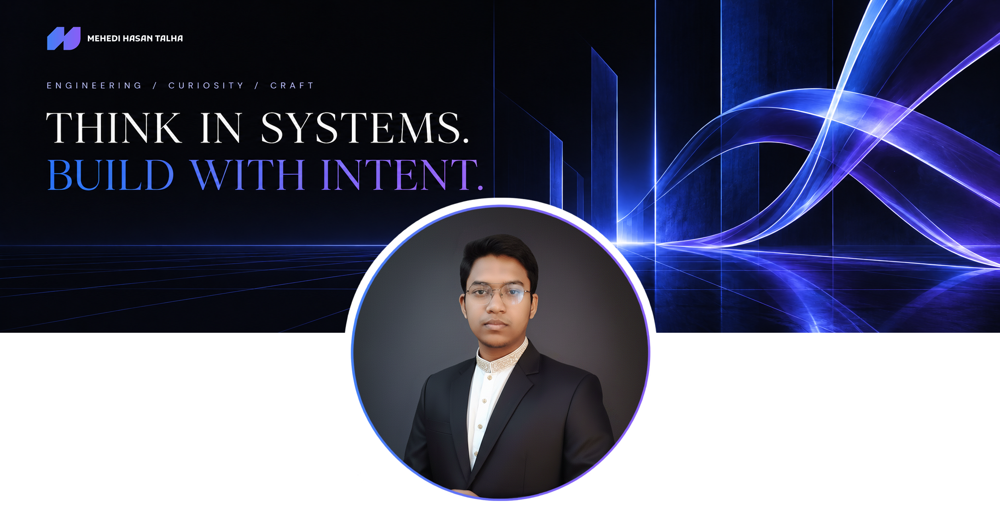

  

<h1 align="center">MD. Mehedi Hasan Talha</h1>

<strong>Full-Stack Engineer</strong> Application ecosystems · Thoughtful architecture · Engineering craft

Based in Rajshahi, Bangladesh · Originally from Kushtia

  <a href="https://www.mehedihasantalha.com/">Portfolio</a> &nbsp; / &nbsp;
  <a href="https://www.linkedin.com/in/md-mehedi-hasan-talha/">LinkedIn</a> &nbsp; / &nbsp;
  <a href="mailto:mdmehedihasantalha2006@gmail.com">Email</a>

---

## The person behind the commits

I’m Talha, a Full-Stack Engineer interested in how an application holds together: the experience people interact with, the logic underneath it, and the architecture that lets it evolve.

My work spans web and mobile application ecosystems, with JavaScript at the centre of my day-to-day engineering. I care about the decisions that remain useful after the first release—clear boundaries, maintainable code, considered interactions, and infrastructure that fits the business behind the software.

I work as a **Full-Stack Engineer, Lead Frontend**, combining hands-on development with frontend coordination and technical decision-making. Previously, as a **Support Instructor**, I helped developers work through technical problems, reviewed assignments, and gave feedback on code quality. Explaining the reasoning behind code is part of my engineering background.

I’m also exploring AI-assisted software development: experimenting, questioning the results, and sharing practical lessons as I learn. The interesting part for me is understanding where these tools help solve a real software problem.

## My engineering compass

| What I pay attention to | How it shapes my work |
| :--- | :--- |
| **The whole system** | Consider how interfaces, business rules, data, and infrastructure affect one another. |
| **Complexity with a reason** | Let actual requirements justify architectural choices, including when to introduce additional services. |
| **The next engineer** | Keep the structure understandable and the reasoning behind important decisions clear. |
| **Cost as a design constraint** | Consider operational effort and business cost alongside implementation choices. |
| **Interaction quality** | Give responsiveness, performance, and the details of an interface deliberate attention. |
| **Learning through explanation** | Turn practical experience into something another developer can understand and use. |

> Code is not just instructions; it is the structural blueprint of human interaction.

## A few coordinates

| | |
| :--- | :--- |
| **Current chapter** | Full-Stack Engineer, Lead Frontend at MakeHub · March 2026–Present |
| **Previous chapter** | Support Instructor at Learn with Sumit · January–December 2025 |
| **Home base** | Rajshahi, Bangladesh · UTC+06:00 |
| **Roots** | Kushtia, Bangladesh |
| **Technical centre of gravity** | JavaScript, React, Next.js, Express.js |
| **Ongoing exploration** | AI-assisted development, application architecture, and practical ways to share what I learn |
| **Topics I return to** | Maintainability, system behaviour, business-fit architecture, and the reasoning behind implementation choices |

## Languages & tools

  

| Area | Technologies I have worked with |
| :--- | :--- |
| **Languages & runtimes** | JavaScript · TypeScript · Node.js · HTML · CSS |
| **Interfaces & state** | React · Next.js · Tailwind CSS · Framer Motion · Redux Toolkit · Zustand |
| **Application & integration** | Express.js · NestJS · REST APIs · GraphQL · Apollo Client · Webhooks · Redis |
| **Data & persistence** | PostgreSQL · MongoDB · MySQL · Prisma · Mongoose · Database schema design |
| **Supporting experience** | PHP · Laravel |

<strong>More from my toolbox</strong>

 

  

These include supporting tools and technologies from earlier work. JavaScript remains my strongest independent working language; my PHP and Laravel experience is in a supporting capacity.

## The contribution trail

A few views of the work that reaches GitHub.

### The wide view

  

### By the numbers · By the hour

  
  

### The language footprint

  
  

### Rhythm over time

  

  

## Learning, with evidence

**Reactive Accelerator · Batch 2 — Learn with Sumit**  
October 2024–February 2025

| Recognition | Detail |
| :--- | :--- |
| **Final result** | **99.4%** · 1292 / 1300 |
| **Certificate of Excellence** | Recognised for outstanding course performance |
| **Recommendation** | Recommendation letter from Sumit Saha, Founder of Learn with Sumit, based on course performance |

[Verify certificate](https://learnwithsumit.com/certificates/verify/LWSCTXN-FPTPOOYV) &nbsp; · &nbsp; [View course report](https://learnwithsumit.com/reports/LWSCTXN-FPTPOOYV)

## Notes from the learning desk

The questions I’m interested in exploring—and sharing what I learn from:

- **When does an architecture earn its complexity?** Thinking through maintainability, operational cost, and real business requirements.
- **What can AI meaningfully change in a developer’s workflow?** Exploring practical assistance, agent workflows, and the limits that need human judgement.
- **Why does software behave differently across environments?** Following the interaction between an application, its infrastructure, and the network around it.
- **How do you make technical reasoning easier to follow?** Carrying lessons from teaching and code review into everyday engineering communication.

## Find me elsewhere

| Place | Link |
| :--- | :--- |
| **Personal website** | [mehedihasantalha.com](https://www.mehedihasantalha.com/) |
| **LinkedIn** | [MD. Mehedi Hasan Talha](https://www.linkedin.com/in/md-mehedi-hasan-talha/) |
| **Facebook** | [mdmehedihasantalha.official](https://www.facebook.com/mdmehedihasantalha.official) |
| **X** | [@devtalha420](https://x.com/devtalha420) |

---

<strong>Understand the system. Refine the craft. Share the learning.</strong>

